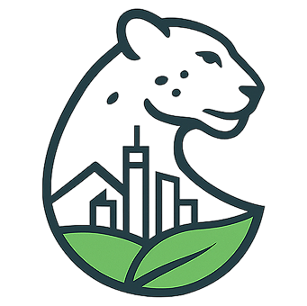

<p align="center">
  
</p>

<h1 align="center">🏙️ TazaQala — Таза Қала</h1>

<p align="center">
  <b>Платформа для мониторинга и устранения экологических нарушений в городе Алматы</b>
</p>

<p align="center">
  
  
  
  
</p>

---

## 📋 О проекте

**TazaQala** (каз. "Чистый город") — веб-приложение для жителей города, позволяющее:

- 📸 **Сообщать о нарушениях** — мусор, вандализм, повреждения природы
- 🗺️ **Отслеживать на карте** — все репорты отображаются в реальном времени
- 🤖 **AI-модерация** — автоматическая проверка фотографий через OpenAI Vision
- 🧹 **Координация уборки** — система для клинеров и волонтёров
- 🏆 **Геймификация** — баллы, рейтинг, награды за активность

---

## 🎯 Типы нарушений

| Категория | Описание |
|-----------|----------|
| 🗑️ Мусор | Незаконные свалки, бытовые отходы |
| 🎨 Вандализм | Граффити, повреждения имущества |
| 🌳 Нарушения природы | Сломанные деревья, повреждения зелёных зон |
| ⚠️ Другое | Прочие экологические нарушения |

---

## 🚀 Быстрый старт

### Требования
- Python 3.10+
- pip

### Установка

```bash
# Клонирование репозитория
git clone https://github.com/nurkal022/TazaQala.git
cd TazaQala

# Создание виртуального окружения
python -m venv venv
source venv/bin/activate  # Linux/Mac
# или venv\Scripts\activate  # Windows

# Установка зависимостей
pip install -r requirements.txt

# Запуск
python app.py
```

Приложение будет доступно по адресу: http://localhost:5000

---

## 🏗️ Структура проекта

```
taza_qala/
├── app/
│   ├── __init__.py          # Инициализация Flask
│   ├── models.py            # Модели базы данных
│   ├── ai_moderator.py      # AI модерация
│   ├── routes/              # Маршруты
│   │   ├── admin.py         # Админ-панель
│   │   ├── api.py           # REST API
│   │   ├── auth.py          # Авторизация
│   │   ├── cleaner.py       # Панель клинера
│   │   ├── main.py          # Основные страницы
│   │   └── reports.py       # Работа с репортами
│   └── templates/           # HTML шаблоны
├── static/
│   ├── css/                 # Стили
│   ├── js/                  # JavaScript
│   ├── img/                 # Изображения
│   └── uploads/             # Загруженные файлы
├── app.py                   # Точка входа
├── config.py                # Конфигурация
├── wsgi.py                  # WSGI для продакшена
└── requirements.txt         # Зависимости
```

---

## 👥 Роли пользователей

| Роль | Возможности |
|------|-------------|
| **Пользователь** | Создание репортов, просмотр карты, накопление баллов |
| **Клинер** | Принятие заявок на уборку, загрузка фото результатов |
| **Модератор** | Проверка репортов, подтверждение уборки |
| **Администратор** | Полный доступ, управление пользователями, статистика |

---

## 🎨 Дизайн

Интерфейс выполнен в цветах флага Казахстана с использованием традиционных казахских орнаментов:

- 🔵 **Голубой** (#00AFCA) — небо и свобода
- 🟡 **Золотой** (#FEC50C) — солнце и благополучие

---

## 🔧 Конфигурация

Основные настройки в `config.py`:

```python
SECRET_KEY = 'your-secret-key'
OPENAI_API_KEY = 'your-openai-key'  # Для AI модерации
```

---

## 📡 API

| Endpoint | Метод | Описание |
|----------|-------|----------|
| `/api/reports` | GET | Список всех репортов |
| `/api/reports/<id>` | GET | Детали репорта |
| `/api/leaderboard` | GET | Рейтинг пользователей |
| `/api/stats` | GET | Статистика платформы |

---

## 🚀 Деплой

См. [DEPLOYMENT.md](DEPLOYMENT.md) для инструкций по развёртыванию на сервере с Nginx + Gunicorn.

---

## 📄 Лицензия

MIT License

---

<p align="center">
  <b>🇰🇿 Сделано с любовью к Алматы</b>
</p>

